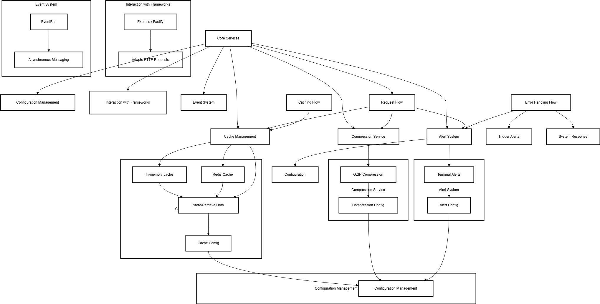

# Technical Overview

## Architecture

HyperShield follows a domain-driven design approach with the following key components:



### Core Components

- **Cache Layer**: Multiple provider support (Redis, Memory) with automatic compression
- **Compression Service**: GZIP implementation with configurable levels
- **Alert System**: Configurable alert dispatching with throttling and retries
- **Metrics**: Built-in Prometheus metrics for monitoring
- **Event Bus**: Internal event system for component communication

### Directory Structure

```
src/
├── adapters/       # Framework adapters (Express, Fastify)
├── core/           # Core types, events, and constants
├── domains/        # Business logic by domain
│   ├── cache/      # Caching functionality
│   ├── compression/# Compression services
│   ├── alerts/     # Alert system
│   └── metrics/    # Metrics collection
└── shared/         # Shared utilities and services
```

## Configuration

### Cache Configuration
```typescript
interface CacheConfig {
  enabled: boolean;
  provider: 'redis' | 'memory';
  ttl: number;
  compression?: boolean;
  connection?: {
    host: string;
    port: number;
    password?: string;
  }
}
```

### Compression Configuration
```typescript
interface CompressionConfig {
  enabled: boolean;
  type: 'gzip';
  level?: number;
  threshold?: number;
}
```

### Metrics Configuration
```typescript
interface MetricsConfig {
  enabled: boolean;
  path?: string;
  defaultLabels?: Record<string, string>;
}
```
